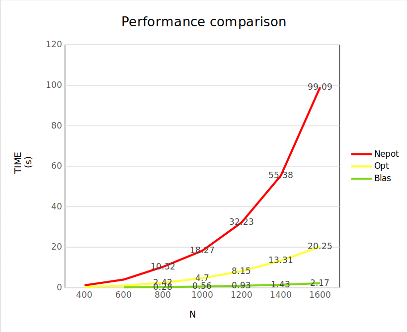

## Zanficu Madalina-Valentina
## Homework 2 - ASC - Matrix Multiplication

### Key concepts: Blas library, Brut force matrix multiplication,
### Optimized matrix multiplication, Cache optimization

#### Task1 - Matrix Multiplication using BLAS library

Functions used:
1. **cblas_dtrmm**(CblasRowMajor, CblasLeft, CblasLower, CblasNoTrans, CblasUnit, N, N, 1, A, N, B, N);

- Used for the operation: A * B = AB and AB * At = ABAt
- Is recommanded for triungular matrices multiplication 
- A is upper triangular and At is lower triangular

2. **cblas_dgemm**(CblasRowMajor, CblasTrans, CblasTrans,
					N, N, N, alpha, B, N, B, N, beta, BtBt, N);

- Used for the operation: Bt * Bt = BtBt
- Is recommanded for non-triangular matrices multiplication

3. **cblas_daxpy**(N * N, alpha, BtBt, 1, AB, 1);
- Used for the operation: AB = ABAt + BtBt
- Y = alpha * X + Y, where X = BtBt and Y = AB
- AB is the final result

Parameters explained:
CblasRowMajor - row-major order
CblasLeft / CblasRight - A is on the left/right side of the operation
CblasLower / CblasUpper - A is lower/upper triangular
CblasNoTrans / CblasTrans - A is not transposed/transposed
CblasUnit / CblasNonUnit - A is unit/non-unit triangular
aplha, beta - scalars

#### TODO: Task2 - Brut force matrix multiplication

#### TODO: Task3 - Optimized matrix multiplication

#### Task4 - analyze the cache behavior with CacheGrind
I refs = instructions executed
D refs = RAM memory accesses
Branches = branches executed

Version      |      I refs              |      D refs       |       Branches    |
Neopt        |      5,936,131,839       |  2,968,670,604    |      132,556,025  |
Opt          |      1,576,627,655       |    916,678,468    |      132,396,511  |
Blas         |        253,791,198       |     95,393,407    |       4,732,665   |

Observations:
- Blas version has the lowest number of instructions executed: ~80% less than then optimized version.

- The optimized version uses x4 less executed instructions than the non-optimized version and x3 less RAM memory accesses.

- Surpringly, the number of branches for both optimized and non-optimized versions is only 0.1% different.

**How the optimization of the opt version influces these values?**
As we can see, the optimized version has less cache misses (Drefs), as my
implementation uses the cache memory more efficiently.
How? By using the matrix traversal: i-k-j, instead of i-j-k 
and matrix B is not traversed column by column, but row by row.
Moreover, I have used register variables for matrix A, B and C 
pointers in order to reduce the number of RAM memory accesses 
and to have them closer to the CPU.

I think that I_refs value is much lower considering that my neopt version has
excesevly used this kind operation: m + i * N + j, but my optimized version has
more "atomic" kind of operations like: m++ and b++ for matrix traversal, 
which in assembly code are translated into a single instruction.

#### TODO: Task 5 - performance analysis of the 3 versions

