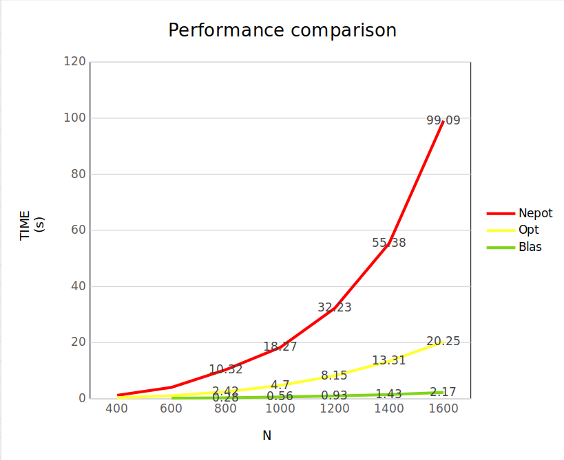

## Zanficu Madalina-Valentina
## Homework 2 - ASC - Matrix Multiplication

### Key concepts: Blas library, Matrix multiplication, Cache optimization, CacheGrind

#### Task1 - Matrix Multiplication using BLAS library

Functions used:
1. **cblas_dtrmm**(CblasRowMajor, CblasLeft, CblasLower, 
						CblasNoTrans, CblasUnit, N, N, 1, A, N, B, N);

- Used for the operation: A * B = AB and AB * At = ABAt
- Is recommanded for triungular matrices multiplication 
- A is upper triangular and At is lower triangular

2. **cblas_dgemm**(CblasRowMajor, CblasTrans, CblasTrans,
					N, N, N, alpha, B, N, B, N, beta, BtBt, N);

- Used for the operation: Bt * Bt = BtBt
- Is recommanded for non-triangular matrices multiplication

3. **cblas_daxpy**(N * N, alpha, BtBt, 1, AB, 1);
- Used for the operation: AB = ABAt + BtBt
- Y = alpha * X + Y, where X = BtBt and Y = AB
- AB is the final result

Parameters explained:
CblasRowMajor - row-major order
CblasLeft / CblasRight - A is on the left/right side of the operation
CblasLower / CblasUpper - A is lower/upper triangular
CblasNoTrans / CblasTrans - A is not transposed/transposed
CblasUnit / CblasNonUnit - A is unit/non-unit triangular
aplha, beta - scalars

#### Task2 - Brut force matrix multiplication

The requested operation is C = A * B * At + Bt * Bt
In order to compute this operation I broke it down into 3 steps:
1. AB = A * B
2. ABAt = AB * At
3. BtBt = Bt * Bt
4. C = ABAt + BtBt

For the first step, I have used **multiply_superior function**.
This function is used to multiply the upper triangular matrix A.
I have used the classical algorithm with i-j-k loops, but in order 
to avoid unnecessary operations (multiplication with 0), k loop starts 
from i and not from 0. I figured this out by multiplying 3x3 matrices by hand.

The second step takes into account that At is lower triangular, 
so I have used **multiply_inferior function**.

And the third step is the general multiplication, 
so I have used **multiply_general function**.

From my perspectiv, this brut force approach is both computationaly 
intensive and memory intensive. 
CPU intenstive because the multiplicatios (m + i * N + j) are done 
at each step - N * N * N times, and memory intensive because matrix B 
is traversed column by column and the cache is not used efficiently.

#### Task3 - Optimized matrix multiplication

The optimzed version follows the same workflow as the neopt version
with multiply_superior, multiply_inferior and multiply_general functions,
but these are the main differences:

1. I have used register variables for matrices A, B and C pointers
in order to reduce the number of RAM memory accesses.

2. I have used matrix traversal: i-k-j, instead of i-j-k. 
In this way, the cache is used more efficiently, 
as B matrix is traversed row by row.

3. I don't have as many CPU intensive operations as in the neopt version.
For example m++ insted of m + i * N + j at each step.

#### Task4 - analyze the cache behavior with CacheGrind
I refs = instructions executed
D refs = RAM memory accesses
Branches = branches executed

Version      |      I refs              |      D refs       |       Branches    |
Neopt        |      5,936,131,839       |  2,968,670,604    |      132,556,025  |
Opt          |      1,576,627,655       |    916,678,468    |      132,396,511  |
Blas         |        253,791,198       |     95,393,407    |       4,732,665   |

Observations:
- Blas version has the lowest number of instructions executed: 
	~80% less than then optimized version.

- The optimized version uses x4 less executed instructions than 
	the non-optimized version and x3 less RAM memory accesses.

- Surpringly, the number of branches for both optimized 
	and non-optimized versions is only 0.1% different.

**How the optimization of the opt version influces these values?**
As we can see, the optimized version has less access to RAM (Drefs),
as my implementation uses the cache memory more efficiently.
How? By using the matrix traversal: i-k-j, instead of i-j-k 
and matrix B is not traversed column by column, but row by row.
Moreover, I have used register variables for matrix A, B and C 
pointers in order to reduce the number of RAM memory accesses 
and to have them closer to the CPU.

I think that I_refs value is much lower considering that my neopt version has
excesevly used this kind operation: m + i * N + j, but my optimized version has
more "atomic" kind of operations like: m++ and b++ for matrix traversal, 
which in assembly code are translated into a single instruction.

#### Task 5 - performance analysis

As we can see from the graph, the unoptimized version is the slowest, and the execution time increases exponentially.
The optimized version is x3-4 times faster that the unpotimized version, as it uses the cache memory more efficiently.
The blas version is the fastest, and time execution increases almost linearly.

These are the execution times for each version for the mandatory tests:

